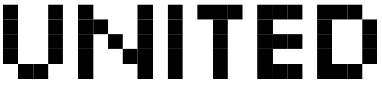

 

 
[](https://codecov.io/gh/lcallarec/united)
[](https://github.com/lcallarec/united/releases)
[](https://github.com/lcallarec/united/blob/master/LICENSE)

#### Unit manipulation made easy

# Units

There's two main units in [United](https://github.com/lcallarec/united/) :

* [`Value`](#value), which hold any [SI derived units](https://en.wikipedia.org/wiki/International_System_of_Units)
* [`Bytes`](#bytes), which can be SI prefixed (ex. kB, MB...) or IEC / Binary prefixed (ex. KiB, GiB...)

And lists of prefixes :

* [`Prefix`](#prefixes), which represent some [SI derived prefixes](https://en.wikipedia.org/wiki/International_System_of_Units)
* [`BinaryPrefix`](#binary-prefixes), which meant to represent [Binary prefixes](https://en.wikipedia.org/wiki/Binary_prefix) to be used with `Bytes`.


## Value

* Create a value :

```vala
// From value and unit (potentially prefixed)
var weight = new Value(5, "g");
var weight = new Value(5.97, "kg");

// From string
var weight = new Value.from_string("15,8g");

//From known attributes
var weight = new Value.from_attributes(8.15, "g", Prefix.kilo());
```

* Public attributes and presentation methods

```vala
var power = new Value.from_string("2.21GW");

power.measure;     // 2.21
power.unit;        // "W"
power.prefix;      // Prefix.GIGA
power.to_string(); // "2.21GW"
power.to_string("%.1f"); // "2.2GW"
```

* Convert to another Prefix

```vala
var power_in_GW = new Value(2.21, "GW");

power_in_GW.measure;     // 2.21
power_in_GW.unit;        // "W"
power_in_GW.prefix;      // Prefix.GIGA
power_in_GW.to_string(); // "2.21GW"


var power_in_kW = power_in_GW.to(Prefix.KILO);

power_in_kW.measure;     // 2210000
power_in_kW.unit;        // "W"
power_in_kW.prefix;      // Prefix.KILO
power_in_kW.to_string(); // "2210000kW"
```

* Convert to an human readable format

Humans don't like to read 2210000000W. They prefer reading number lower than 1000.

```vala
var power_in_GW = new Value(2210000000, "W");

var human_readable = power_in_GW.to_human();

human_readable.measure;     // 2.21
human_readable.unit;        // "W"
human_readable.prefix;      // Prefix.GIGA
human_readable.to_string(); // "2.21GW"
```

# Prefixes

Prefixes are mostly used to convert a value to another value, or print a custom value.

```vala
var yotta   = Prefix.yotta();   //Shortcut for new Prefix(Prefix.YOTTA);
var zeta    = Prefix.zeta();    //Shortcut for new Prefix(Prefix.ZETA);
var exa     = Prefix.exa();     //Shortcut for new Prefix(Prefix.EXA);
var peta    = Prefix.peta();    //Shortcut for new Prefix(Prefix.PETA);
var tera    = Prefix.tera();    //Shortcut for new Prefix(Prefix.TERA);
var giga    = Prefix.giga();    //Shortcut for new Prefix(Prefix.GIGA);
var mega    = Prefix.mega();    //Shortcut for new Prefix(Prefix.MEGA);
var kilo    = Prefix.kilo();    //Shortcut for new Prefix(Prefix.KILO);
var none    = Prefix.none();    //Shortcut for new Prefix(Prefix.NONE);
var milli   = Prefix.milli();   //Shortcut for new Prefix(Prefix.MILLI);
var micro   = Prefix.micro();   //Shortcut for new Prefix(Prefix.MICRO);
var nano    = Prefix.nano();    //Shortcut for new Prefix(Prefix.NANO);
var pico    = Prefix.pico();    //Shortcut for new Prefix(Prefix.PICO);
var femto   = Prefix.femto();   //Shortcut for new Prefix(Prefix.FEMTO);
var atto    = Prefix.atto();    //Shortcut for new Prefix(Prefix.ATTO);
var zepto   = Prefix.zepto();   //Shortcut for new Prefix(Prefix.ZEPTO);
var yocto   = Prefix.yocto();   //Shortcut for new Prefix(Prefix.YOCTO);

// Convert
var power = new Value(2.21, "GW");
var MW = power.to(Prefix.mega());

MW.measure;     // 2210
MW.unit;        // "W"
MW.prefix;      // Prefix.MEGA
MW.to_string(); // "2210MW"

```

Print a prefix :

```vala
yotta.to_string(); // "Y"
zeta.to_string();  // "Z"
exa.to_string();   // "E"
peta.to_string();  // "P"
tera.to_string();  // "T"
giga.to_string();  // "G"
mega.to_string();  // "M"
kilo.to_string();  // "k"
none.to_string();  // "" 
milli.to_string(); // "m"
micro.to_string(); // "μ"
nano.to_string();  // "n"
pico.to_string();  // "p"
femto.to_string(); // "f"
atto.to_string();  // "a"
zepto.to_string(); // "z"
yocto.to_string(); // "y"
```

## Bytes

Bytes share most of the `Value` features.

* Create a Bytes :

```vala
// From value and unit (potentially prefixed)
var size = new Bytes(5, "B");
var size = new Value(5.97, "MB");

```

* Public attributes and presentation methods

```vala
var size = new Bytes(2097152, "B");

size.value;       // 2097152
size.unit;        // "B"
size.prefix;      // Prefix.NONE
size.to_string(); // "2097152BW"
```

* Convert to another Prefix

SI prefixes :

```vala
var b = new Bytes(2097152, "B");

var kb = b.to(Prefix.kilo());

kb.value;       // 2097,152
kb.unit;        // "B"
kb.prefix;      // Prefix.KILO
kb.to_string(); // "2097,152kB"
```

To binary prefixes :

```vala
var b = new Bytes(2097152, "B");
var kb = b.to(Prefix.kilo());
var MiB = kb.to(BinaryPrefix.mebi());

kb.value;       // 2
kb.unit;        // "B"
kb.prefix;      // BinaryPrefix.MEBI;
kb.to_string(); // "2MiB"
```

* Convert to an human readable format

Humans don't like to read 2097152B. They prefer reading number lower than 1000.

```vala
var b = new Bytes(2097152, "B");
var human_readable = b.to_human();

human_readable.to_string(); // "2MiB"
```

# Binary prefixes

Binary prefixes should only be used with Bytes type.

```vala
var yobi = BinaryPrefix.yobi(); // Shortcut for new BinaryPrefix(BinaryPrefix.YOBI);
var zebi = BinaryPrefix.zebi(); // Shortcut for new BinaryPrefix(BinaryPrefix.ZEBI);
var exbi = BinaryPrefix.exbi(); // Shortcut for new BinaryPrefix(BinaryPrefix.EXBI);
var pebi = BinaryPrefix.pebi(); // Shortcut for new BinaryPrefix(BinaryPrefix.PEBI);
var tebi = BinaryPrefix.tebi(); // Shortcut for new BinaryPrefix(BinaryPrefix.TEBI);
var gibi = BinaryPrefix.gibi(); // Shortcut for new BinaryPrefix(BinaryPrefix.GIBI);
var mebi = BinaryPrefix.mebi(); // Shortcut for new BinaryPrefix(BinaryPrefix.MEBI);
var kibi = BinaryPrefix.kibi(); // Shortcut for new BinaryPrefix(BinaryPrefix.KIBI);
var none = BinaryPrefix.none(); // Shortcut for new BinaryPrefix(BinaryPrefix.NONE);

// Convert
var size = new Bytes(1024);
var KB = size.to(BinaryPrefix.kilo());

KB.value;       // 1
KB.unit;        // "B"
KB.prefix;      // BinaryPrefix.KILO;
KB.to_string(); // "1KiB"

```

Print a prefix :

```vala
yobi.to_string(); // "Yi"
zebi.to_string(); // "Zi"
exbi.to_string(); // "Ei"
pebi.to_string(); // "Pi"
tebi.to_string(); // "Ti"
gibi.to_string(); // "Gi"
mebi.to_string(); // "Mi"
kibi.to_string(); // "Ki"
none.to_string(); // ""
```